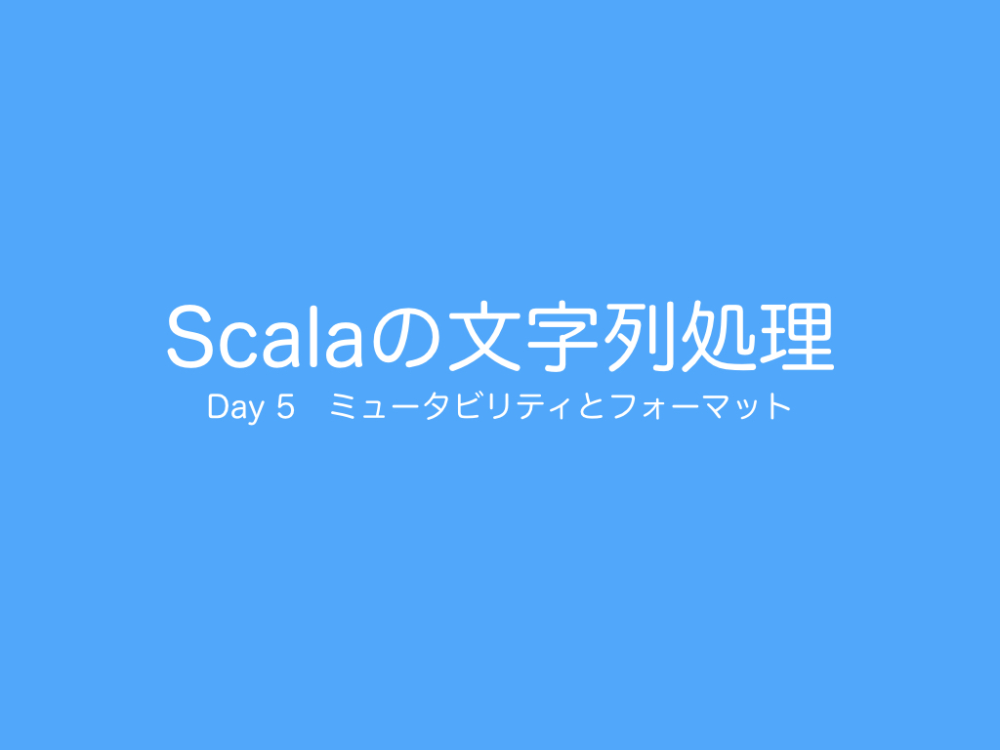

<h1>Day 5 ミュータビリティとフォーマット</h1>
 
今日は、ミュータビリティとフォーマットについて紹介したいと思います。  

<h2>リポジトリ（サンプルコード）</h2>
<a href="https://github.com/ynupc/scalastringcourseday5" target="_blank">https://github.com/ynupc/scalastringcourseday5</a>  

<h2>クイズ</h2>
<a href="http://ynupc.github.io/quiz/scalastringcourse/day5/" target="_blank">http://ynupc.github.io/quiz/scalastringcourse/day5/</a>  

<h2>目次</h2>
