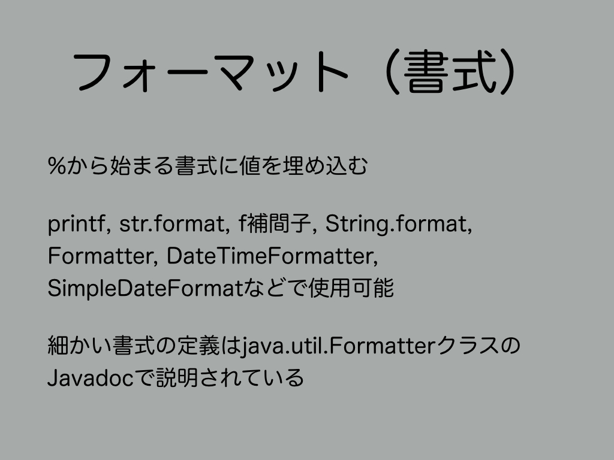
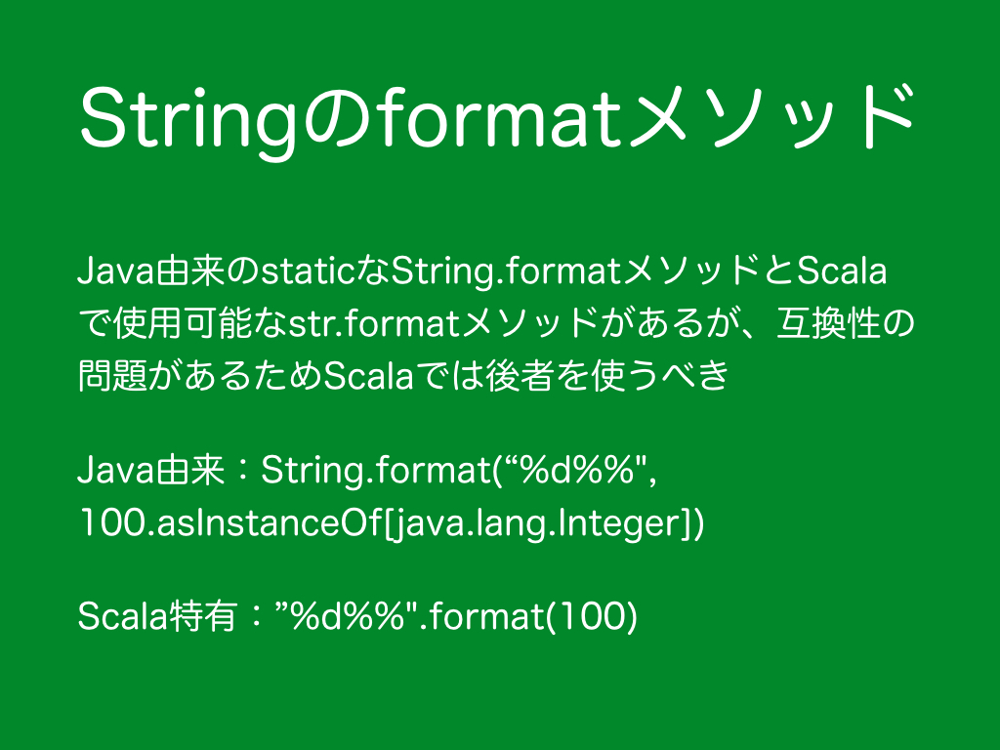
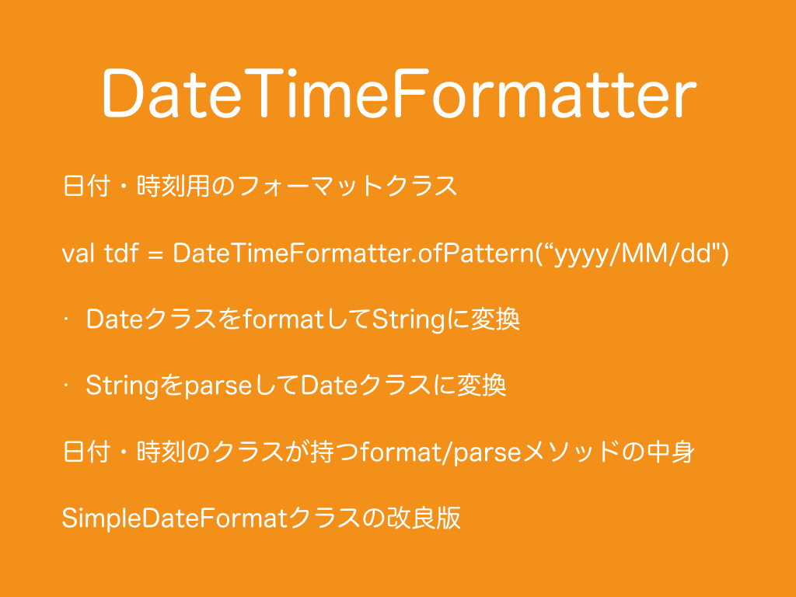
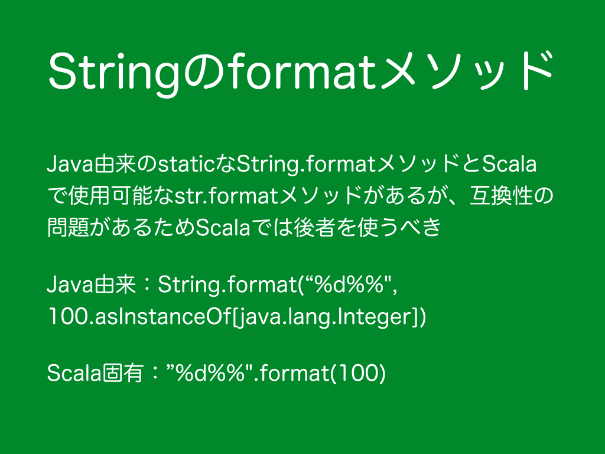

#2.　フォーマット
<br>
***
<h3>2.1　Stringのformatメソッド</h3>
<br>
```scala
  @Test
  def testFormat1(): Unit = {
    assert("%d%%".format(100) == "100%")
    assert(String.format("%d%%", 100.asInstanceOf[java.lang.Integer]) == "100%")
  }
```
フォーマットとは、%から始まるフォーマットに値を埋め込みStringを生成する方式のことです。
printf、str.format、f補間子、String.format、Formatter、MessageFormat、NumberFormat、ChoiceFormat、DecimalFormat、DateFormat、DateTimeFormatter、SimpleDateFormatなどで使用可能です。
細かなフォーマットの定義は<a href="http://docs.oracle.com/javase/jp/8/docs/api/java/util/Formatter.html" target="_blank">java.util.FormatterクラスのJavadoc</a>で説明されます。
```scala
  @Test
  def testFormat2(): Unit = {
    //%
    assert("%%".format() == "%")
    //Char
    assert("%c".format('x') == "x")
    //String
    assert("%s".format("xyz") == "xyz")
    //10進数
    assert("%d".format(123) == "123")
    assert("%d".format(-123) == "-123")
    //正数に+付き10進数
    assert("%+d".format(123) == "+123")
    assert("%+d".format(-123) == "-123")
    //正数にスペース付き10進数
    assert("% d".format(123) == " 123")
    assert("% d".format(-123) == "-123")
    //負数に()付き10進数
    assert("%(d".format(123) == "123")
    assert("%(d".format(-123) == "(123)")
    //3桁ごとカンマ付き10進数
    assert("%,d".format(12345) == "12,345")
    //0埋め
    assert("%05d".format(123) == "00123") //prepend
    assert(123.toString.padTo(5, '0') == "12300") //padToはappend
    //16進数
    assert("%x".format(123) == "7b")
    //16進数代替フォーム
    assert("%#x".format(123) == "0x7b")
    //8進数
    assert("%o".format(123) == "173")
    //8進数代替フォーム
    assert("%#o".format(123) == "0173")
    //右詰
    assert("[%4d]".format(123) == "[ 123]")
    //左詰
    assert("[%-4d]".format(123) == "[123 ]")
    //最大表示幅指定（幅を超えたものは切り捨て）
    assert("[%.4s]".format("xyzab") == "[xyza]")
    assert("[%5.4s]".format("xyzab") == "[ xyza]")
    assert("[%-5.4s]".format("xyzab") == "[xyza ]")
    //直前と同じ値（直前と同じものを引数に入れるくらいなら、これを使用した方が効率的）
    assert("%d:%<d:%d:%<d".format(1, 22) == "1:1:22:22")
    //引数のインデックス指定（同じものを連続せずに何度も引数に入れるくらいなら、これでまとめる方が効率的）
    assert("%d:%d:%d".format(1, 22, 333) == "1:22:333")
    assert("%1$d:%2$d:%3$d".format(1, 22, 333) == "1:22:333")
    assert("%3$d:%1$d:%2$d".format(1, 22, 333) == "333:1:22")
    assert("%3$d:%1$d:%d:%d:%3$d".format(1, 22, 333) == "333:1:1:22:333")
    //真偽値（小文字）
    //nullの場合はfalse
    //プリミティブ型booleanでもラッパークラスのBooleanでもない場合はtrue
    assert("%b".format(true) == "true")
    assert("%b".format(java.lang.Boolean.TRUE) == "true")
    assert("%b".format(0) == "true")
    assert("%b".format(false) == "false")
    assert("%b".format(java.lang.Boolean.FALSE) == "false")
    assert("%b".format(null) == "false")
    //真偽値（大文字）
    //nullの場合はfalse
    //プリミティブ型booleanでもラッパークラスのBooleanでもない場合はtrue
    assert("%B".format(true) == "TRUE")
    assert("%B".format(java.lang.Boolean.TRUE) == "TRUE")
    assert("%B".format(0) == "TRUE")
    assert("%B".format(false) == "FALSE")
    assert("%B".format(java.lang.Boolean.FALSE) == "FALSE")
    assert("%B".format(null) == "FALSE")
    //浮動小数
    assert("%e".format(math.Pi) == "3.141593e+00")
    assert("%f".format(math.Pi) == "3.141593")
    assert("%g".format(math.Pi) == "3.14159")
    assert("%a".format(math.Pi) == "0x1.921fb54442d18p1")
    //OS非依存の改行文字
    //Unix: \n
    //Windows: \r\n
    printf("%n")
    //日付・時刻
    printf("%1$tY年%1$tm月%1$td日%tA\n", new Date())
    printf("%1$tY年%1$tm月%1$td日%tA%n".formatLocal(java.util.Locale.US, new Date()))
    println("%1$tY年%1$tm月%1$td日%tA".formatLocal(java.util.Locale.JAPAN, new Date()))
    //ハッシュコード（16進数）
    printf("%h\n", new Object())
  }
```
***
<h3>2.2　DateTimeFormatter</h3>
<br>
SimpleDateFormatはスレッドアンセーフでありながらスレッドセーフなDateTimeFormatterより処理速度が遅いためSimpleDateFormatの使用はお勧めできません。DateTimeFormatterはJava 8から導入されたためJava 7以前でスレッドセーフな日付・時刻フォーマッターが欲しい場合は、自作されるか、<a href="https://commons.apache.org/proper/commons-lang/" target="_blank">Apache Commons Lang</a>の<a href="https://commons.apache.org/proper/commons-lang/javadocs/api-release/org/apache/commons/lang3/time/FastDateFormat.html" target="_blank">FastDateFormat</a>クラス、<a href="https://commons.apache.org/proper/commons-lang/javadocs/api-release/org/apache/commons/lang3/time/FastDateParser.html" target="_blank">FastDateParser</a>クラス、<a href="https://commons.apache.org/proper/commons-lang/javadocs/api-release/org/apache/commons/lang3/time/FastDatePrinter.html" target="_blank">FastDatePrinter</a>クラスを使用すると良いでしょう。
```scala
  @Test
  def testDateTimeFormatter(): Unit = {
    val zonedDateTime: ZonedDateTime = ZonedDateTime.now
    val tdf: DateTimeFormatter = DateTimeFormatter.ofPattern("yyyy/MM/dd")
    println(tdf.format(zonedDateTime))
    println(zonedDateTime.format(tdf))

    val localDate1: LocalDate = LocalDate.parse("2016/01/01", tdf)
    val date1: Date = Date.from(localDate1.atStartOfDay(ZoneOffset.UTC).toInstant)

    val ta: TemporalAccessor = tdf.parse("2016/01/01")
    val localDate2: LocalDate = LocalDate.from(ta)
    val date2: Date = Date.from(localDate2.atStartOfDay(ZoneOffset.of("+09:00")).toInstant)

    assert("%1$tY年%1$tm月%1$td日".format(date1) == "2016年01月01日")
    assert("%1$tY年%1$tm月%1$td日".format(date2) == "2016年01月01日")
  }
```
***
<h3>2.3　テンプレートエンジン</h3>
<br>
