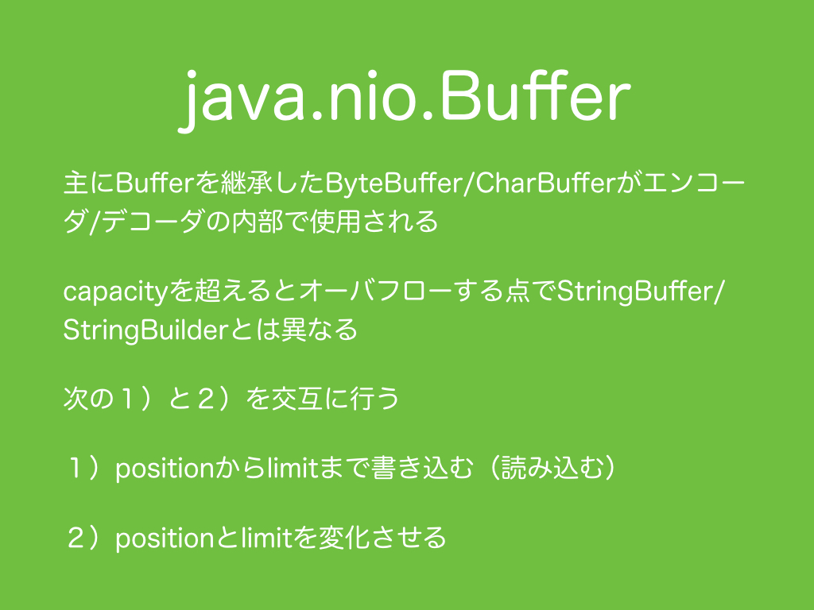
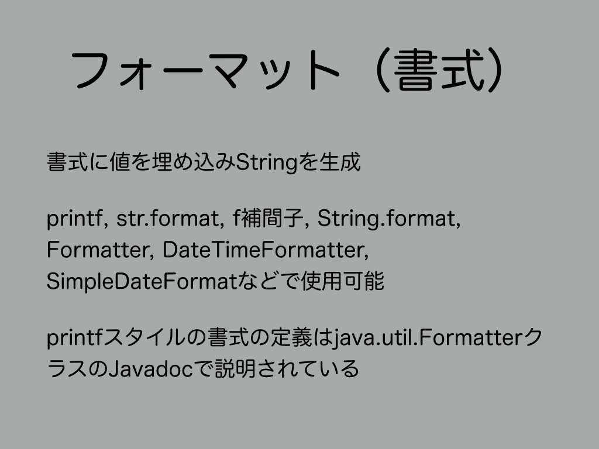

#2.　フォーマット
<br>
フォーマットとは、Stringで書かれた書式に値を埋め込みStringを生成する処理のことです。
%から始まるprintfスタイルの書式は、
printf、str.format、f補間子、String.format、<a href="http://docs.oracle.com/javase/jp/8/docs/api/java/util/Formatter.html" target="_blank">Formatter</a>などで使用可能です。
%から始まらない書式は、<a href="http://docs.oracle.com/javase/jp/8/docs/api/java/time/format/DateTimeFormatter.html" target="_blank">DateTimeFormatter</a>、<a href="http://docs.oracle.com/javase/jp/8/docs/api/java/text/MessageFormat.html" target="_blank">MessageFormat</a>、<a href="http://docs.oracle.com/javase/jp/8/docs/api/java/text/NumberFormat.html" target="_blank">NumberFormat</a>、<a href="http://docs.oracle.com/javase/jp/8/docs/api/java/text/ChoiceFormat.html" target="_blank">ChoiceFormat</a>、<a href="http://docs.oracle.com/javase/jp/8/docs/api/java/text/DecimalFormat.html" target="_blank">DecimalFormat</a>、<a href="http://docs.oracle.com/javase/jp/8/docs/api/java/text/DateFormat.html" target="_blank">DateFormat</a>、<a href="http://docs.oracle.com/javase/jp/8/docs/api/java/text/SimpleDateFormat.html" target="_blank">SimpleDateFormat</a>などがあります。
printfスタイルの書式の定義は<a href="http://docs.oracle.com/javase/jp/8/docs/api/java/util/Formatter.html" target="_blank">java.util.FormatterクラスのJavadoc</a>で説明されます。
***
<h3>2.1　Stringのformatメソッド</h3>
<br>
Java由来のstaticなString.formatメソッドとScalaで使用可能な非staticなformatメソッドがあるが、staticなString.formatメソッドにはJavaとの互換性の問題が発生するため、Scalaでは非staticなformatメソッドを使用するべきでしょう。
```scala
  @Test
  def testFormat1(): Unit = {
    assert("%d%%".format(100) == "100%")
    assert(String.format("%d%%", 100.asInstanceOf[java.lang.Integer]) == "100%")
  }
```
printfスタイルの書式の定義は膨大なので、代表的な書式についてのみサンプルコードにまとめます。
```scala
  @Test
  def testFormat2(): Unit = {
    //%
    assert("%%".format() == "%")
    //Char
    assert("%c".format('x') == "x")
    //String
    assert("%s".format("xyz") == "xyz")
    //10進数
    assert("%d".format(123) == "123")
    assert("%d".format(-123) == "-123")
    //正数に+付き10進数
    assert("%+d".format(123) == "+123")
    assert("%+d".format(-123) == "-123")
    //正数にスペース付き10進数
    assert("% d".format(123) == " 123")
    assert("% d".format(-123) == "-123")
    //負数に()付き10進数
    assert("%(d".format(123) == "123")
    assert("%(d".format(-123) == "(123)")
    //3桁ごとカンマ付き10進数
    assert("%,d".format(12345) == "12,345")
    //0埋め
    assert("%05d".format(123) == "00123") //prepend
    assert(123.toString.padTo(5, '0') == "12300") //padToはappend
    //16進数
    assert("%x".format(123) == "7b")
    //16進数代替フォーム
    assert("%#x".format(123) == "0x7b")
    //8進数
    assert("%o".format(123) == "173")
    //8進数代替フォーム
    assert("%#o".format(123) == "0173")
    //右詰
    assert("[%4d]".format(123) == "[ 123]")
    //左詰
    assert("[%-4d]".format(123) == "[123 ]")
    //最大表示幅指定（幅を超えたものは切り捨て）
    assert("[%.4s]".format("xyzab") == "[xyza]")
    assert("[%5.4s]".format("xyzab") == "[ xyza]")
    assert("[%-5.4s]".format("xyzab") == "[xyza ]")
    //直前と同じ値（直前と同じものを引数に入れるくらいなら、これを使用した方が効率的）
    assert("%d:%<d:%d:%<d".format(1, 22) == "1:1:22:22")
    //引数のインデックス指定（同じものを連続せずに何度も引数に入れるくらいなら、これでまとめる方が効率的）
    assert("%d:%d:%d".format(1, 22, 333) == "1:22:333")
    assert("%1$d:%2$d:%3$d".format(1, 22, 333) == "1:22:333")
    assert("%3$d:%1$d:%2$d".format(1, 22, 333) == "333:1:22")
    assert("%3$d:%1$d:%d:%d:%3$d".format(1, 22, 333) == "333:1:1:22:333")
    //真偽値（小文字）
    //nullの場合はfalse
    //プリミティブ型booleanでもラッパークラスのBooleanでもない場合はtrue
    assert("%b".format(true) == "true")
    assert("%b".format(java.lang.Boolean.TRUE) == "true")
    assert("%b".format(0) == "true")
    assert("%b".format(false) == "false")
    assert("%b".format(java.lang.Boolean.FALSE) == "false")
    assert("%b".format(null) == "false")
    //真偽値（大文字）
    //nullの場合はfalse
    //プリミティブ型booleanでもラッパークラスのBooleanでもない場合はtrue
    assert("%B".format(true) == "TRUE")
    assert("%B".format(java.lang.Boolean.TRUE) == "TRUE")
    assert("%B".format(0) == "TRUE")
    assert("%B".format(false) == "FALSE")
    assert("%B".format(java.lang.Boolean.FALSE) == "FALSE")
    assert("%B".format(null) == "FALSE")
    //浮動小数
    assert("%e".format(math.Pi) == "3.141593e+00")
    assert("%f".format(math.Pi) == "3.141593")
    assert("%g".format(math.Pi) == "3.14159")
    assert("%a".format(math.Pi) == "0x1.921fb54442d18p1")
    //OS非依存の改行文字
    //Unix: \n
    //Windows: \r\n
    printf("%n")
    //日付・時刻
    printf("%1$tY年%1$tm月%1$td日%tA\n", new Date())
    printf("%1$tY年%1$tm月%1$td日%tA%n".formatLocal(java.util.Locale.US, new Date()))
    println("%1$tY年%1$tm月%1$td日%tA".formatLocal(java.util.Locale.JAPAN, new Date()))
    //ハッシュコード（16進数）
    printf("%h\n", new Object())
  }
```
***
<h3>2.2　DateTimeFormatter</h3>
<br>
DateTimeFormatterは日付・時刻に関するフォーマット及びバースの処理を扱うクラスです。
タイムゾーン付きの日付・時間クラス<a href="http://docs.oracle.com/javase/jp/8/docs/api/java/time/ZonedDateTime.html" target="_blank">ZonedDateTime</a>クラスを入力しフォーマットしたStringを返したり、Stringを入力としてパースしZonedDateTimeクラスを出力することができます。
String.formatではZonedDateTimeクラスではなくDateクラスを与えることでフォーマットすることができます。
DateTimeFormatterと同様の処理をSimpleDateFormatで実現できますが、
SimpleDateFormatはスレッドアンセーフでありながらスレッドセーフなDateTimeFormatterより処理速度が遅いためSimpleDateFormatの使用はお勧めできません。DateTimeFormatterはJava 8から導入されたためJava 7以前でスレッドセーフな日付・時刻フォーマッターが欲しい場合は、自作されるか、<a href="https://commons.apache.org/proper/commons-lang/" target="_blank">Apache Commons Lang</a>の<a href="https://commons.apache.org/proper/commons-lang/javadocs/api-release/org/apache/commons/lang3/time/FastDateFormat.html" target="_blank">FastDateFormat</a>クラス、<a href="https://commons.apache.org/proper/commons-lang/javadocs/api-release/org/apache/commons/lang3/time/FastDateParser.html" target="_blank">FastDateParser</a>クラス、<a href="https://commons.apache.org/proper/commons-lang/javadocs/api-release/org/apache/commons/lang3/time/FastDatePrinter.html" target="_blank">FastDatePrinter</a>クラスを使用すると良いでしょう。
```scala
  @Test
  def testDateTimeFormatter(): Unit = {
    val zonedDateTime: ZonedDateTime = ZonedDateTime.now
    val tdf: DateTimeFormatter = DateTimeFormatter.ofPattern("yyyy/MM/dd")
    println(tdf.format(zonedDateTime))
    println(zonedDateTime.format(tdf))

    val localDate1: LocalDate = LocalDate.parse("2016/01/01", tdf)
    val date1: Date = Date.from(localDate1.atStartOfDay(ZoneOffset.UTC).toInstant)

    val ta: TemporalAccessor = tdf.parse("2016/01/01")
    val localDate2: LocalDate = LocalDate.from(ta)
    val date2: Date = Date.from(localDate2.atStartOfDay(ZoneOffset.of("+09:00")).toInstant)

    assert("%1$tY年%1$tm月%1$td日".format(date1) == "2016年01月01日")
    assert("%1$tY年%1$tm月%1$td日".format(date2) == "2016年01月01日")
  }
```
<h3>2.3　DateFormatとSimpleDateFormat</h3>
```scala
  @Test
  def testDateFormat(): Unit = {
    val date: Date = new Date(Long.MinValue)
    val dateFormat1: DateFormat = DateFormat.getDateInstance
    println(dateFormat1.format(date) == "292269055/12/03")
    println(dateFormat1.parse("292269055/12/03"))
    val dateFormat2: DateFormat = DateFormat.getTimeInstance
    println(dateFormat2.format(date) == "1:47:04")
    println(dateFormat2.parse("1:47:04"))
    val dateFormat3: DateFormat = DateFormat.getDateTimeInstance
    println(dateFormat3.format(date) == "292269055/12/03 1:47:04")
    println(dateFormat3.parse("292269055/12/03 1:47:04"))
  }

  @Test
  def testSimpleDateFormat(): Unit = {
    val date: Date = new Date(Long.MaxValue)
    val simpleDateFormat: SimpleDateFormat = new SimpleDateFormat("Y年M月D日（E）")
    println(simpleDateFormat.format(date))
    println(simpleDateFormat.parse("292278994年8月229日（日）"))
  }

  private class ObjectExample(private var data: Int) {
    def increment(): Unit = {
      synchronized[Unit] {
        data += 1
      }
    }

    def getData: Int = {
      synchronized[Int] {
        data
      }
    }
  }

```
<h3>2.4　NumberFormatとDecimalFormat</h3>

```scala
  @Test
  def testNumberFormat(): Unit = {
    val numberFormat1: NumberFormat = NumberFormat.getInstance(Locale.JAPAN)

    assert(numberFormat1.getCurrency.getCurrencyCode == "JPY")

    assert(numberFormat1.format(100L) == "100")
    //noinspection ComparingUnrelatedTypes
    assert(numberFormat1.parse("100") == 100)
    assert(numberFormat1.format(0.5772156649D) == "0.577")
    //noinspection ComparingUnrelatedTypes
    assert(numberFormat1.parse("0.577") == 0.577)

    val numberFormat2: NumberFormat = NumberFormat.getIntegerInstance(Locale.JAPAN)
    assert(numberFormat2.format(100L) == "100")
    //noinspection ComparingUnrelatedTypes
    assert(numberFormat2.parse("100") == 100)
    assert(numberFormat2.format(0.5772156649D) == "1")
    //noinspection ComparingUnrelatedTypes
    assert(numberFormat2.parse("0.577") == 0)

    val numberFormat3: NumberFormat = NumberFormat.getCurrencyInstance(Locale.JAPAN)

    assert(numberFormat3.format(100L) == "￥100")
    //noinspection ComparingUnrelatedTypes
    assert(numberFormat3.parse("￥100") == 100)
    assert(numberFormat3.format(0.5772156649D) == "￥1")
    //noinspection ComparingUnrelatedTypes
    assert(numberFormat3.parse("￥0.577") == 0.577)

    val numberFormat4: NumberFormat = NumberFormat.getPercentInstance(Locale.JAPAN)
    assert(numberFormat4.format(100L) == "10,000%")
    //noinspection ComparingUnrelatedTypes
    assert(numberFormat4.parse("10,000%") == 100)
    assert(numberFormat4.format(0.5772156649D) == "58%")
    //noinspection ComparingUnrelatedTypes
    assert(numberFormat4.parse("57.7%") == 0.5770000000000001)//buggy???
  }

  @Test
  def testDecimalFormat(): Unit = {
    val decimalFormat: DecimalFormat = new DecimalFormat()
    assert(decimalFormat.getCurrency.getCurrencyCode == "JPY")
    assert(decimalFormat.format(100L) == "100")
    //noinspection ComparingUnrelatedTypes
    assert(decimalFormat.parse("100") == 100)
    assert(decimalFormat.format(0.5772156649D) == "0.577")
    //noinspection ComparingUnrelatedTypes
    assert(decimalFormat.parse("0.577") == 0.577)
  }
```
<h3>2.5　ChoiceFormat</h3>
```scala
  @Test
  def testChoiceFormat1(): Unit = {
    val choiceFormat: ChoiceFormat =
      new ChoiceFormat(
        Array[Double](-1D, 0D),
        Array[String]("負の数", "正の数"))

    //num < -1
    assert(choiceFormat.format(-2) == "負の数")
    //-1<= num < 0
    assert(choiceFormat.format(-0.5D) == "負の数")
    //0 <= num
    assert(choiceFormat.format(0D) == "正の数")
    assert(choiceFormat.format(1D) == "正の数")
    //noinspection ComparingUnrelatedTypes
    assert(choiceFormat.parse("負の数") == -1D)
    //noinspection ComparingUnrelatedTypes
    assert(choiceFormat.parse("正の数") == 0D)
  }

  @Test
  def testChoiceFormat2(): Unit = {
    val choiceFormat: ChoiceFormat =
      new ChoiceFormat(
        Array[Double](-1D, 0D, ChoiceFormat.nextDouble(0D)),
        Array[String]("負の数", "0", "正の数"))
    //num < -1
    assert(choiceFormat.format(-2) == "負の数")
    //-1<= num < 0
    assert(choiceFormat.format(-0.5D) == "負の数")
    //num == 0
    assert(choiceFormat.format(0D) == "0")
    //0 < num
    assert(choiceFormat.format(1D) == "正の数")
    //noinspection ComparingUnrelatedTypes
    assert(choiceFormat.parse("負の数") == -1D)
    //noinspection ComparingUnrelatedTypes
    assert(choiceFormat.parse("0") == 0D)
    //noinspection ComparingUnrelatedTypes
    assert(choiceFormat.parse("正の数") == ChoiceFormat.nextDouble(0D))
  }

  @Test
  def testChoiceFormat3(): Unit = {
    val choiceFormat: ChoiceFormat = new ChoiceFormat("-1#負の数| 0#0| 0<正の数")
    //num < -1
    assert(choiceFormat.format(-2) == "負の数")
    //-1<= num < 0
    assert(choiceFormat.format(-0.5D) == "負の数")
    //num == 0
    assert(choiceFormat.format(0D) == "0")
    //0 < num
    assert(choiceFormat.format(1D) == "正の数")
    //noinspection ComparingUnrelatedTypes
    assert(choiceFormat.parse("負の数") == -1D)
    //noinspection ComparingUnrelatedTypes
    assert(choiceFormat.parse("0") == 0D)
    //noinspection ComparingUnrelatedTypes
    assert(choiceFormat.parse("正の数") == ChoiceFormat.nextDouble(0D))
  }
```
<h3>2.6　MessageFormat</h3>
```scala
  @Test
  def testMessageFormat(): Unit = {
    val messageFormat: MessageFormat = new MessageFormat("今日は{0,date,yyyy年MM月dd日}、時刻は{0,time}。天気は{1}です。")
    println(messageFormat.format(Array[Object](new Date(0L), "晴れ")))
    val parsed = messageFormat.parse("今日は1970年01月01日、時刻は9:00:00。天気は晴れです。")

    assert(parsed(1) == "晴れ")
  }
```
***
<h3>2.7　テンプレートエンジン</h3>
<br>
Javaでフォーマットで複数行の雛形を作成したい場合、書式内に```%n```または```\n```を含めたワンライナーで書く必要があります。
そのような書式はとても読みづらく可読性・保守性の観点からよくありません。
この場合、<a href="http://velocity.apache.org/" target="_blank">Apache Velocity</a>や<a href="https://github.com/jknack/handlebars.java" target="_blank">Handlebars.java</a>などのようなテンプレートエンジンを用いることで複数行の雛形を作成し、値を埋め込むことができ、可読性・保守性が向上します。
Scalaには<a href="https://github.com/ynupc/scalastringcourseday2/blob/master/doc/literal.md" target="_blank">Day 2</a>で説明した生文字リテラルが存在するため、生文字リテラルにフォーマットや文字列補間子を組み合わせることやXMLリテラルで、テンプレートエンジンと似た処理ができます。
ただし、テンプレートエンジンは雛形をプログラムと別のファイルとして外部化する点が異なります。
XMLリテラルによるテンプレート処理については、<a href="#コラムxmlリテラルによるテンプレート処理">コラム：XMLリテラルによるテンプレート処理</a>を参照ください。
***
<h3>コラム：XMLリテラルによるテンプレート処理</h3>
XMLリテラルによってフォーマットや文字列補間子のように雛形に値を埋め込みStringを生成することができます。
