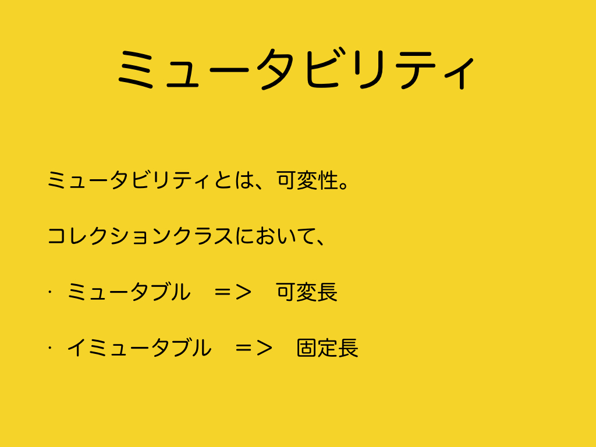
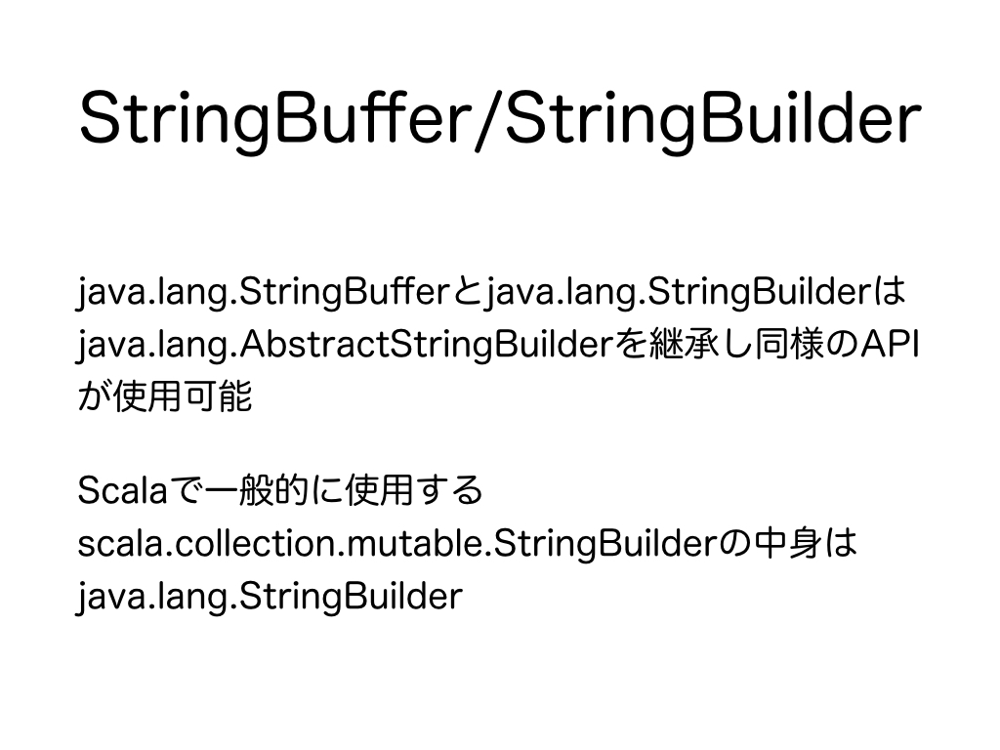
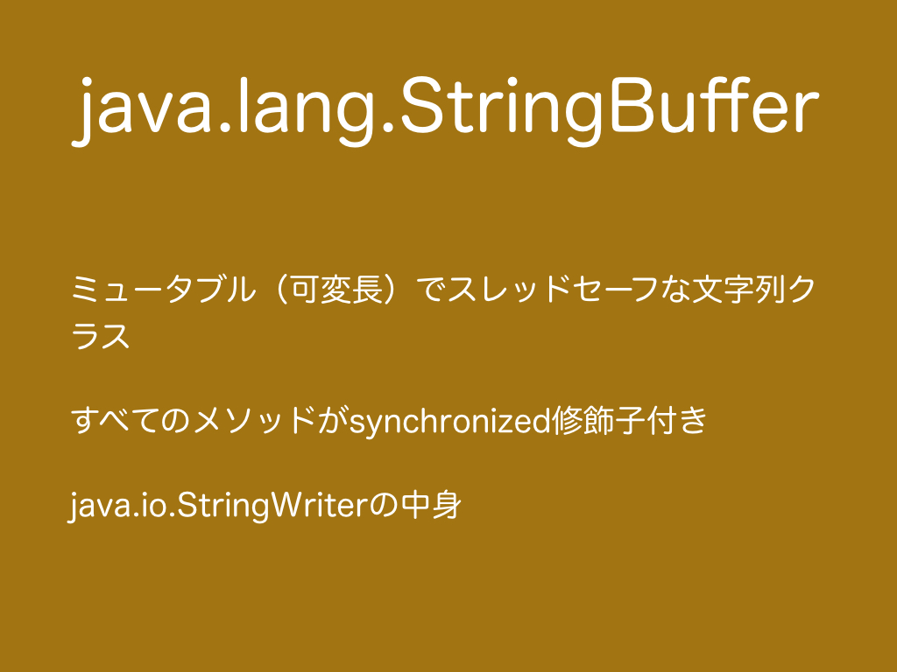

#1.　ミュータビリティ
<h3>1.1　ミュータビリティ</h3>
<br>
ミュータビリティとは可変性・不変性を示す言葉です。ミュータブルは可変性を意味し、イミュータブルは固定性を意味します。変数がインスタンス化後に変更可能なクラスをミュータブルクラス、変更不可能なクラスをイミュータブルクラスと呼びます。コレクションのクラスではミュータブルは可変長、イミュータブルは固定長を意味します。<br>
***
<h3>1.2　スレッドセーフティ</h3>
<br>
スレッドセーフティとはマルチスレッド下でも問題なく動作するかどうかを示す言葉です。
マルチスレッド下ではシングルスレッドで発生しない様々な問題が発生します。
例えば、スレッドAとスレッドBが同一クラスを操作するとスレッドAが操作している変数vを、その操作が終わっていないにも関わらず、スレッドBが操作してしまい、スレッドAが想定している結果と違う値の変数vになってしまう場合があります。
この時、スレッドAが操作している時に変数vをスレッドBが操作できないように制御（排他制御）されている状態はスレッドセーフであり、スレッドAが操作している時に変数vをスレッドBが操作できる状態はスレッドアンセーフです。<br>
排他制御の方法として、変数をコンストラクタでの初期化以外変更できないようにする方法（テレスコーピングコンストラクタパターン）や変数を全てprivateにし（テレスコーピングコンストラクタパターン以外、JavaBeansパターンやビルダーパターンなど）変数を操作するメソッド全てにsynchronizedをつける方法があります。<br>
テレスコーピングコンストラクタパターン・JavaBeansパターン・ビルダーパターンについては、<a href="#コラムテレスコーピングコンストラクタパターンjavabeansパターンビルダーパターン">コラム：テレスコーピングコンストラクタパターン・JavaBeansパターン・ビルダーパターン</a>を参照ください。マルチスレッドプログラミングについては、<a href="#コラムマルチスレッドプログラミング">コラム：マルチスレッドプログラミング</a>を参照ください。
***
<h3>1.3　文字列クラスのミュータビリティとスレッドセーフティ</h3>
<br>
Stringはイミュータブルクラスなので、インスタンス化後に操作可能な変数がないためスレッドセーフです。
StringBuilderとStringBufferはミュータブルクラスです。StringBuilderはスレッドアンセーフですが、StringBufferはスレッドセーフです。
一見するとイミュータブルをミュータブル、スレッドアンセーフよりスレッドセーフの方が優れていて、常にミュータブルでスレッドセーフなStringBufferクラスだけを存在すればいいのではと思うかもしれません。しかし、イミュータブルをミュータブルにするとクラスに載せるメソッドが増えメモリを多く使います。スレッドアンセーフからスレッドセーフにすると排他制御のためのオーバヘッドが発生します。

> JDK 5以降、このクラスは単一のスレッドStringBuilderにより使用されるよう設計された等価のクラスで補足されています。StringBuilderクラスは、このクラスと同じ処理をすべてサポートしながらも高速であり、同期を実行しないので、通常はこのクラスに優先して使用される必要があります。

（<a href="https://docs.oracle.com/javase/jp/8/docs/api/java/lang/StringBuffer.html" target="_blank">Java 8 StringBuffer</a>より）<br>
（実際に処理速度にあまり大きな差があるのかは不明です。）このようなトレードオフ（一方を追求すると一方を犠牲にせざるをえない状態）が発生するので、目的に合わせて使用するクラスを選択しましょう。
***
<h3>1.4　String</h3>
<br>
Stringはイミュータブル（固定長）でスレッドセーフな文字列クラスです。
＋メソッドやunionメソッドで文字列を結合するときはSeqLikeで<a href="http://www.scala-lang.org/api/current/index.html#scala.collection.generic.CanBuildFrom" target="_blank">CanBuildFrom</a>を用いてミュータブルなビルダークラスmutable.Builderを生成して文字列を結合し、新しいインスタンスを生成しています。(JavaではStringBuilderが内部処理で使用されます。)
新しいインスタンスを生成する点はconcatメソッドでも同様です。
２つの文字列を結合するときはconcat、３つ以上の文字列を結合するときは+メソッドかStringBuilderを使用するのが高速です。unionメソッドによる結合は速度が落ちます。
```scala
  @Test
  def testStringUnion(): Unit = {
    val str = "A"

    assert(str + "B" == "AB")
  }

  @Test
  def testStringConcat(): Unit = {
    val str = "A"

    assert(str.concat("B") == "AB")
  }
```
***
<h3>1.5　StringBuffer/StringBuilder</h3>
<br>
java.lang.StringBufferやjava.lang.StringBuilderはjava.lang.AbstractStringBuilderを継承しているため同じAPIが利用できます。
Scalaで一般的に使うStringBuilderはjava.lang.StringBuilderではなくscala.collection.mutable.StringBuilderです。java.lang.StringBuilderはscala.collection.mutable.StringBuilderの内部で使用されているためjava.lang.StringBuilderと同じAPIが利用できます。<br>
<br>
末尾に追加するappendやappendCodePointメソッドでStringの+メソッドで結合可能な型やコードポイントを結合することができます。Charを結合させるのが最も高速です。メソッドチェーンで記述できます。先頭に追加するprependメソッドはないですが、insertメソッドで先頭や好きな位置に挿入することが可能です。appendメソッドで末尾に追加してからreverseメソッドで結合した文字の順番を逆転させる方法もあります。toStringメソッドでStringに変換することができます。scala.collection.mutable.StringBuilderではresultメソッドでStringに変換できます。<br>
<br>
capacityはCharを入れるための容量（Char数）です。コンストラクタからインスタンス生成時にcapacityを指定することができます。特に指定しない場合デフォルトコンストラクタによりcapacityは16に設定されます。インスタンス生成後にもしCharを入れすぎてcapacityを超えてもオーバーフローせずに自動的に新たに容量を増やします。新たに容量を獲得する処理がオーバーヘッドとして発生するので、capacityが不足すると処理速度が低下します。しかし、処理を高速化するために十分に容量を獲得してcapacityを大きく取りすぎるとメモリの領域を使い過ぎてしまいます。capacityを大きく取りすぎてメモリの領域を無駄に使用している場合はtrimToSizeメソッドで収容しているChar数=lengthにcapacityを揃えることができます。<br>
<br>
delete(0, length)とsetLength(0)はlengthを0にして収容物を破棄します。capacityは変えません。scala.collection.mutable.StringBuilderのclearの中身はsetLength(0)です。delete(0, length)でもsetLength(0)/clearでも処理の結果は同じですが、setLength(0)/clearの方が一般に使用されているようです。setLength(0)/clearはポインタをずらしています。deleteメソッドはSystem.arraycopyメソッドを使用しています。
<br>
StringBufferはミュータブル（可変長）でスレッドセーフな文字列クラスです。
全てのメソッドにsynchronized修飾子がついていて排他制御されています。
java.io.StringWriterの中身です。<br>
<br>
StringBuilderはミュータブル（可変長）でスレッドアンセーフな文字列クラスです。
java.lang.StringBuilderはscala.collection.mutable.StringBuilderの中身です。
java.lang.StringBuilderはjava.lang.StringBufferとAPIの互換性が保たれるように設計されています。
```scala
  @Test
  def testStringBuffer(): Unit = {
    var buffer: StringBuffer = new StringBuffer()

    assert(buffer.capacity == 16)
    assert(buffer.length == 0)

    buffer = new StringBuffer(3)

    assert(buffer.capacity == 3)
    assert(buffer.length == 0)

    val array: Array[String] = Array[String]("abc", "cde", "efg")
    for (i <- array.indices) {
      i match {
        case 0 =>
          buffer.append(array(i))
          assert(buffer.capacity == 3)
        case 1 =>
          buffer.append(array(i))
          assert(buffer.capacity == 8)
        case 2 =>
          buffer.append(array(i))
          assert(buffer.capacity == 18)
        case otherwise =>
          //Do nothing
      }
    }

    assert(buffer.capacity == 18)

    var str: String = buffer.toString
    assert(str == "abccdeefg")

    assert(buffer.length == 9)

    buffer.setLength(0)

    assert(buffer.capacity == 18)
    assert(buffer.length == 0)

    str = buffer.toString
    assert(str == "")
  }

  @Test
  def testStringBuilder1(): Unit = {
    var builder: StringBuilder = new StringBuilder()

    assert(builder.capacity == 16)
    assert(builder.length == 0)

    builder = new StringBuilder(3)

    assert(builder.capacity == 3)
    assert(builder.length == 0)

    val array: Array[String] = Array[String]("abc", "cde", "efg")
    for (element <- array) {
      builder.append(element)
    }
    var str: String = builder.result
    assert(str == "abccdeefg")

    assert(builder.length == 9)

    builder.setLength(0)

    assert(builder.capacity == 18)
    assert(builder.length == 0)

    str = builder.result
    assert(str == "")

    for (element <- array) {
      builder.append(element)
    }

    assert(builder.capacity == 18)
    assert(builder.length == 9)

    //clearメソッドはJavaにはないが、中身はsetLength(0)
    builder.clear

    assert(builder.capacity == 18)
    assert(builder.length == 0)

    for (element <- array) {
      builder.append(element)
    }

    builder.delete(0, builder.length)

    assert(builder.capacity == 18)
    assert(builder.length == 0)
  }

  @Test
  def testStringBuilder2(): Unit = {
    var builder: java.lang.StringBuilder = new java.lang.StringBuilder()

    assert(builder.capacity == 16)
    assert(builder.length == 0)

    builder = new java.lang.StringBuilder(3)

    assert(builder.capacity == 3)
    assert(builder.length == 0)

    val array: Array[String] = Array[String]("abc", "cde", "efg")
    for (element <- array) {
      builder.append(element)
    }
    var str: String = builder.toString
    assert(str == "abccdeefg")

    assert(builder.length == 9)

    builder.setLength(0)

    assert(builder.capacity == 18)
    assert(builder.length == 0)

    str = builder.toString
    assert(str == "")
  }
```
***
<h3>1.6　StringJoiner</h3>
<br>
StringJoinerはデリミタ（区切り文字）と任意で接頭辞・接尾辞を設定して、文字列を結合するクラスです。
addメソッドで文字列を追加し、toStringでStringを出力するビルダークラスです。
例えば、<a href="https://ja.wikipedia.org/wiki/Comma-Separated_Values" target="_blank">CSV、SSV、TSV</a>などを作成するときに有用です。
StringJoinerの中身はStringBuilderです。
```scala
  @Test
  def testStringJoiner1(): Unit = {
    val array: Array[String] = Array[String]("abc", "cde", "efg")
    val joiner: StringJoiner = new StringJoiner(", ", "[", "]")
    array foreach {
      element =>
        joiner.add(element)
    }
    assert(joiner.toString == "[abc, cde, efg]")
  }

  @Test
  def testStringJoiner2(): Unit = {
    val array = Array[String]("abc", "cde", "efg")
    val joiner = new StringJoiner(", ")
    array foreach {
      element =>
        joiner.add(element)
    }
    assert(joiner.toString == "abc, cde, efg")
  }
```
***
<h3>1.7　String.joinメソッド</h3>
<br>
String.joinの中身はStringJoinerですが、接頭辞・接尾辞を与えることはできません。
mkStringメソッドを組み合わせて使用することでStringJoiner相当のことができますが、mkStringメソッドの処理分だけ速度が遅くなるので素直にStringJoinerを使用することをお勧めします。<br>
String.joinよりStringJoinerの方が高速であり、StringJoinerよりStringBuilderの方が高速だという報告が掲載されたブログの記事があります（<a href="http://d.hatena.ne.jp/nowokay/20140409" target="_blank">Java8時代の文字列連結まとめ</a>）。
String.joinはJavaの可変長引数メソッドとIterableを引数とするメソッドの２つありますが、どちらもScalaで使用する場合はJavaとの互換性を考慮する必要があります。Iterableを引数とするメソッドを使用した場合、ScalaのコレクションをJavaのIterableに変換する処理が発生するため、その分だけ処理速度が遅くなります。可変長引数に関するのJavaとScalaの間の互換性については、<a href="#コラム可変長引数に関するのjavascala互換性">コラム：可変長引数に関するのJava/Scala互換性</a>、コレクションに関するJavaとScalaの間の互換性については、<a href="#コラムコレクションに関するjavascala互換性">コラム：コレクションに関するJava/Scala互換性</a>、String.joinメソッドの引数はjava.lang.Iteratorではなくjava.lang.Iterableですが、java.lang.Iteratorとjava.lang.Iterableの違いについては<a href="">コラム：java.lang.Iteratorとjava.lang.Iterableの違い</a>を参照ください。
```scala
  @Test
  def testStringJoin1(): Unit = {
    val array = Array[String]("abc", "cde", "efg")
    assert(String.join(", ", array: _*) == "abc, cde, efg")
    assert(String.join(", ", array: _*).mkString("[", "", "]") == "[abc, cde, efg]")
  }

  @Test
  def testStringJoin2(): Unit = {
    val array = Array[String]("abc", "cde", "efg")
    val iterable: java.lang.Iterable[String] = scala.collection.JavaConversions.asJavaIterable(array.toIterable)
    assert(String.join(", ", iterable) == "abc, cde, efg")
    assert(String.join(", ", iterable).mkString("[", "", "]") == "[abc, cde, efg]")
  }
  
  @Test
  def testStringJoin3(): Unit = {
    val array = Array[String]("abc", "cde", "efg")
    import scala.collection.JavaConverters._
    val iterable: java.lang.Iterable[String] = array.toIterable.asJava
    assert(String.join(", ", iterable) == "abc, cde, efg")
    assert(String.join(", ", iterable).mkString("[", "", "]") == "[abc, cde, efg]")
  }
```
***
<h3>1.8　PrintWriter (StringWriter)/PrintStream (ByteArrayOutputStream)</h3>
<br>
PrintWriterやPrintStreamのprint, println, printfメソッドを使って文字列を生成する方法があります。PrintWriterを使用する方がPrintStreamを使用するより高速です。<br>
参考文献：<br>
<a href="http://www.ne.jp/asahi/hishidama/home/tech/java/string.html#PrintWriter" target="_blank">PrintWriter/PrintStream</a>
```scala
  @Test
  def testPrintWriter(): Unit = {
    val stringWriter: StringWriter = new StringWriter()
    val printWriter: PrintWriter = new PrintWriter(stringWriter)

    printWriter.print(true)
    printWriter.println("abc")
    printWriter.printf("%d\n", 123.asInstanceOf[java.lang.Integer])

    printWriter.close()

    assert(stringWriter.toString ==
      """trueabc
        |123""".stripMargin.concat("\n"))
  }

  @Test
  def testPrintStream(): Unit = {
    val byteArrayOutputStream: ByteArrayOutputStream = new ByteArrayOutputStream()
    val printStream: PrintStream = new PrintStream(byteArrayOutputStream)

    printStream.print(true)
    printStream.println("abc")
    //noinspection ScalaMalformedFormatString
    printStream.printf("%d\n", 123.asInstanceOf[java.lang.Integer])

    printStream.close()
    println(byteArrayOutputStream.toString)

    assert(byteArrayOutputStream.toString ==
      """trueabc
        |123""".stripMargin.concat("\n"))
  }
```
***
<h3>1.9　java.nio.Buffer</h3>
<br>
java.nio.Bufferは主にBufferを継承したByteBuffer・CharBufferがエンコーダ・デコーダの内部で使用されます。
StringBuilder・StringBufferではcapacityを超えてCharを追加しようとすると自動的にcapacityを増やしてくれますが、ByteBuffer・CharBufferではcapacityは増えずにオーバフローします。どの位置から読み込む/書き込むかというpositionとどの位置まで読み込める/書き込めるかというlimitを変化させながらデータを読み込んだり書き込んだりします。
```scala
  private val utf8ByteArray1ForBufferTest: Array[Byte] =
    for (byte <- Array[Int](
      0xF0, 0xA0, 0xAE, 0xB7,//𠮷=U+20BB7=U+D842,U+DFB7
      0xE9, 0x87, 0x8E,//野=U+91CE
      0xE5, 0xAE, 0xB6,//家=U+5BB6
      0x00, 0x00, 0x00,
      0x00, 0x00, 0x00,
      0x00, 0x00, 0x00
    )) yield byte.toByte

  private val utf8ByteArray2ForBufferTest: Array[Byte] =
    for (byte <- Array[Int](
      0xF0, 0xA0, 0xAE, 0xB7,//𠮷=U+20BB7=U+D842,U+DFB7
      0xE9, 0x87, 0x8E,//野=U+91CE
      0xE5, 0xAE, 0xB6 //家=U+5BB6
    )) yield byte.toByte

  private val capacity = 16

  private val utf8ByteArray3ForBufferTest: Array[Byte] =
    {
      for (i <- 0 until capacity) yield {
        if (i < utf8ByteArray2ForBufferTest.length) {
          utf8ByteArray2ForBufferTest(i)
        } else {
          0: Byte
        }
      }
    }.toArray

  @Test
  def testBufferForEncoder1(): Unit = {
    val str = "𠮷野家"
    val encoder: CharsetEncoder = StandardCharsets.UTF_8.newEncoder.
      onMalformedInput(CodingErrorAction.REPORT).
      onUnmappableCharacter(CodingErrorAction.REPORT)
    val charBuffer: CharBuffer = CharBuffer.wrap(str)
    val byteBuffer: ByteBuffer = encoder.encode(charBuffer)
    val byteArray: Array[Byte] = byteBuffer.array
    assert(byteArray sameElements utf8ByteArray1ForBufferTest)
  }

  @Test
  def testBufferForEncoder2(): Unit = {
    val str = "𠮷野家"
    val encoder: CharsetEncoder = StandardCharsets.UTF_8.newEncoder.
      onMalformedInput(CodingErrorAction.REPORT).
      onUnmappableCharacter(CodingErrorAction.REPORT)
    val charBuffer: CharBuffer = CharBuffer.wrap(str)
    val byteBuffer: ByteBuffer = ByteBuffer.allocate(capacity)
    val coderResult: CoderResult = encoder.reset.encode(charBuffer, byteBuffer, true)
    assert(coderResult == CoderResult.UNDERFLOW)
    coderResult match {
      case CoderResult.UNDERFLOW =>
        val byteArray: Array[Byte] = byteBuffer.array
        assert(byteArray sameElements utf8ByteArray3ForBufferTest)
      case CoderResult.OVERFLOW =>
        //Do nothing
    }
  }

  @Test
  def testBufferForDecoder1(): Unit = {
    val byteArray: Array[Byte] = utf8ByteArray2ForBufferTest
    val decoder: CharsetDecoder = StandardCharsets.UTF_8.newDecoder.
      onMalformedInput(CodingErrorAction.REPORT).
      onUnmappableCharacter(CodingErrorAction.REPORT)
    val byteBuffer: ByteBuffer = ByteBuffer.wrap(byteArray)
    val charBuffer: CharBuffer = decoder.decode(byteBuffer)
    val str = charBuffer.toString
    assert(str == "𠮷野家")
  }

  @Test
  def testBufferForDecoder2(): Unit = {
    val byteArray: Array[Byte] = utf8ByteArray2ForBufferTest
    val decoder: CharsetDecoder = StandardCharsets.UTF_8.newDecoder.
      onMalformedInput(CodingErrorAction.REPORT).
      onUnmappableCharacter(CodingErrorAction.REPORT)
    val byteBuffer: ByteBuffer = ByteBuffer.wrap(byteArray)
    val charBuffer: CharBuffer = CharBuffer.allocate(capacity)
    val coderResult: CoderResult = decoder.reset.decode(byteBuffer, charBuffer, true)
    assert(coderResult == CoderResult.UNDERFLOW)
    coderResult match {
      case CoderResult.UNDERFLOW =>
        val str = charBuffer.flip.toString
        assert(str == "𠮷野家")
      case CoderResult.OVERFLOW =>
        //Do nothing
    }
  }
```
***
<h3>コラム：テレスコーピングコンストラクタパターン・JavaBeansパターン・ビルダーパターン</h3>
生成に関するデザインパターンにはテレスコーピングコンストラクタパターン・JavaBeansパターン・ビルダーパターンなどがあります。
StringBufferやStringBuilderはビルダーパターンで設計されています。
<h4>（１）テレスコーピングコンストラクタパターン</h4>
生成に必須なパラメタを引数に与えるコンストラクタの他に、必須なパラメタに加え任意のパラメタを引数に与えるコンストラクタをクラスに持たせます。
任意のパラメタ数が増えれば増えるだけコンストラクタ数が増加するため、良くないパターン（アンチパターン）と考えられる場合もありますが、クラスが持つ変数をコンストラクタの中でのみいじれるようにすることでスレッドセーフなイミュータブルクラスを作成することができます。
テレスコーピングとは、望遠鏡の筒のようにはめ込むという意味です。
パラメタをコンストラクタにはめ込む（テレスコープする）のでテレスコーピングコンストラクタパターンと呼ばれているのだと思います。
<h4>（２）JavaBeansパターン</h4>
引数なしのデフォルトコンストラクタにより生成し、setter/getterメソッドによって値の変更・取得を行います。
Scalaには<a href="http://www.scala-lang.org/files/archive/api/current/index.html#scala.beans.BeanProperty" target="_blank">@BeanProperty</a>や<a href="http://www.scala-lang.org/files/archive/api/current/index.html#scala.beans.BooleanBeanProperty" target="_blank">@BooleanBeanProperty</a>アノテーションでクラス内のvar変数fieldNameに注釈付けることでsetter/getterメソッド（setFieldName/getFieldName、@BooleanBeanPropertyの場合はgetFieldNameの代わりにisFieldName）を自動挿入します。
JavaBeansパターンではsetterメソッドが必要なため必ずミュータブルクラスになります。
JavaBeansとは、Javaで書かれた移植可能なプラットフォームに依存しないコンポーネントモデルであり、<a href="http://download.oracle.com/otndocs/jcp/7224-javabeans-1.01-fr-spec-oth-JSpec/" target="_blank">JavaBean仕様</a>に従うもののことを指します。

<h4>（３）ビルダーパターン</h4>
まず、生成に必須なパラメタを引数に与えるコンストラクタによりビルダークラスを生成します。
次に、ビルダークラスにsetterメソッドで任意のパラメタを設定します。
最後に、ビルダークラスのbuildメソッドにより、生成したいインスタンスを生成します。
StringBuffer/StringBuilderはビルダーパターンで設計されています。
StringBuffer/StringBuilderがビルダークラスで、buildメソッドはtoStringメソッド、生成したいインスタンスはStringです。
***
<h3>コラム：マルチスレッドプログラミング</h3>
マルチスレッドプログラミングにおいては、同じクラスを複数のスレッドが操作して目的通りに動作しないデータ競合が起こったり、デッドロックが起こってしまうといった危険がありスレッドセーフティを意識してプログラミングすることが大切です。そのためにどのように排他制御・非同期して、どのように同期するかについては様々なことを学ぶ必要があります。サンプルコードには変数の操作がsynchronizedされたクラスと３種類のマルチスレッド（１）Thread、（２）java.util.concurrent、（３）Actorの実装例を載せます。なお、サンプルコードではList型のコレクションクラスlistをfor文で回すとき、parメソッドによって処理を複数のプロセッサに分散化しています。<br>
参考文献：
<ul>
  <li><a href="https://twitter.github.io/scala_school/concurrency.html" target="_blank">Concurrency in Scala</a></li>
  <li><a href="http://doc.akka.io/docs/akka/2.4.1/scala/actors.html" target=_blank">Actors</a></li>
</ul>
```scala
  private class ObjectExample(private var data: Int) {
    def increment(): Unit = {
      synchronized[Unit] {
        data += 1
      }
    }

    def getData: Int = {
      synchronized[Int] {
        data
      }
    }
  }

  private val list: List[Int] = (0 to 3).toList
  private val objectExample: ObjectExample = new ObjectExample(-1)

  private class ThreadExample(name: String) extends Runnable {
    def run() = {
      Thread.sleep(1000L)
      objectExample.increment()
      val data: Int = objectExample.getData
      printf("%s-data=%d%n", name, data)
    }
  }

  /**
    * Thread
    */
  @Test
  def multiThread1(): Unit = {
    for (i <- list.par) {
      val thread: Thread = new Thread(new ThreadExample(s"example1-threadNumber$i"))
      thread.start()
    }
  }

  /**
    * java.util.concurrent
    */
  @Test
  def multiThread2(): Unit = {
    for (i <- list.par) {
      val executor: ExecutorService = Executors.newSingleThreadExecutor()
      executor.execute(new ThreadExample(s"example2-threadNumber$i"))
      executor.shutdown()
    }
  }

  private class ActorExample extends Actor {
    override def receive: Receive = {
      case name =>
        Thread.sleep(1000L)
        objectExample.increment()
        val data: Int = objectExample.getData
        printf("%s-data=%d%n", name, data)
        context.system.terminate()
    }
  }

  /**
    * akka.actor
    */
  @Test
  def multiThread3(): Unit = {
    val system: ActorSystem = ActorSystem("actor-example")
    for (i <- list.par) {
      val actor: ActorRef = system.actorOf(Props(new ActorExample()), s"actorExample$i")
      actor ! s"example3-actorNumber$i"
    }
    Await.result(system.whenTerminated, Duration.Inf)
  }
```
***
<h3>コラム：可変長引数に関するのJava/Scala互換性</h3>
Javaの可変長引数は配列型に変換され、Scalaの可変長引数はSeq型に変換されます。
Javaの可変長引数を持つメソッドにScalaからArrayで値を渡したい場合は、Array型の引数arrayの後ろに```array : _*```のように型アノテーションをつける必要があります。
Scalaの可変長引数を持つメソッドをJavaから使用する場合はJavaで使用するときと同様に配列で値を渡せます。
***
<h3>コラム：コレクションに関するJava/Scala互換性</h3>
ScalaからJavaのコレクションを呼び出したいとき、もしくはJavaからScalaのコレクションを呼び出したいとき、<a href="http://www.scala-lang.org/api/current/index.html#scala.collection.JavaConverters$" target="_blank">scala.collection.JavaConverters</a>か<a href="http://www.scala-lang.org/api/current/index.html#scala.collection.JavaConversions$" target="_blank">scala.collection.JavaConversions</a>を使用することでScalaとJavaのコレクションの相互変換のメソッドが置かれています。JavaConvertersは明示的な変換が必要ですが、JavaConversionsは暗黙的な変換がされるため、JavaConvertersの方が安全に使用できます。JavaConversionsは今後非推奨になりそうです。<br>
参考文献：<br>
<a href="http://docs.scala-lang.org/ja/overviews/collections/conversions-between-java-and-scala-collections.html" target="_blank">Java と Scala 間のコレクションの変換</a><br>
<a href="http://d.hatena.ne.jp/xuwei/20160327/1459108797" target="_blank">scala.collection.JavaConversionsが非推奨になるかもしれないらしい</a>
***
<h3>コラム：java.lang.Iteratorとjava.lang.Iterableの違い</h3>
